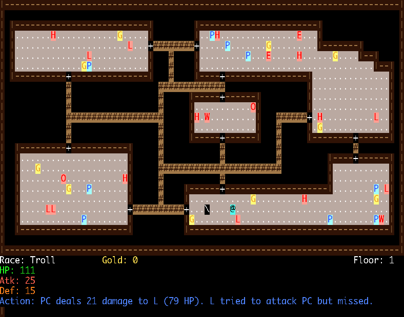

# CC3k
## Game Description
ChamberCrawler3000, a classical roguelike game.

A game of CC3k consists of a board 79 columns wide and 30 rows high (5 rows are reserved for displaying information). Game play is as follows: the player character moves through a dungeon and slays enemies and collects treasure until reaching the end of the dungeon (where the end of the dungeon is the 5th floor). A dungeon consists of different floors that consist of chambers connected with passages.
### Screenshots




### Definitions
- A **character** is a person /animal/thing in the game of CC3k. This can be either the player character (PC), who is controlled by the player of the game, or non-playable characters, who are strictly enemies in CC3k.
- An **item** is something the player character can pick up or use. In CC3k, this is either gold or potions. Potions offer potentially positive and negative effects to the player character.
- A **chamber** is an individual room in the game of CC3k. Chambers are connected by passages. 
- A **floor** in CC3k is a predefined configuration of 5 chambers with connecting passageways.
- **Health Points** (HP) is the representation of a character’s health (both enemies and the player character). When a character’s HP reaches 0, they are slain. For an enemy this means that they are removed from the floor and a tidy sum of gold is given to the player character. When the player character has 0 HP then the current game ends.
- **Attack** (Atk) is the representation of a character’s strength. This is how hard a character can hit another character. In CC3k conflict is solely between the player character and non-playable characters.
- **Defense** (Def ) is the representation of a character’s toughness. This is how hard a character can be hit by another character.
- A **cell** is either a wall, floor tile, doorway, or passage. 
- Something being **spawned** means that the particular something (an enemy, gold, etc) should be generated and placed on the board.
- A 1 **block radius** denotes the 8 cells adjacent to the character or item. If the character is near an edge or a corner, there are fewer adjacent cells.
### Player Character
The default player character race is a shade 4 that has starting stats (125 HP, 25 Atk, 25 Def). However, players have the option of choosing an alternate (but no less heroic) race: drow (150 HP, 25 Atk , 15 Def, all potions have their effect magnified by 1.5), vampire (50 HP, 25 Atk, 25 Def, gains 5 HP every successful attack and has no maximum HP), troll (120 HP, 25 Atk, 15 Def, regains 5 HP every turn; HP is capped at 120 HP), and goblin (110 HP, 15 Atk, 20 Def, steals 5 gold from every slain enemy). Max HP for all races is the starting HP, except for vampires that have no maximum. In our game board, the player character is always denoted by the ‘@’ symbol.
### Enemies
Enemies are the mortal foes of our illustrious player character. In a traditional rogue-like game, the enemy character would have some degree of artificial intelligence. However, for simplicity in CC3k, enemies, except for dragons, move one square randomly within the confines of the chamber they were spawned in. Dragons are stationary and always guard a treasure hoard. 

Enemies can be one of human (140 HP, 20 Atk, 20 Def, drops 2 normal piles of gold), dwarf (100 HP, 20 Atk, 30 Def, Vampires are allergic to dwarves and lose 5 HP rather than gain), elf (140 HP, 30 Atk, 10 Def, gets two attacks against every race except drow), orcs (180 HP, 30 Atk, 25 Def, does 50% more damage to goblins), merchant (30 HP, 70 Atk, 5 Def), dragon (150 HP, 20 Atk, 20 Def, always guards a treasure hoard), and halfling (100 HP, 15 Atk, 20 Def, has a 50% chance to cause the player character to miss in combat, i.e. takes priority over player character’s ability to never miss).

By default, merchants are neutral to all parties 5 . However, merchants can be attacked and slain by the player character. Attacking or slaying a Merchant causes every Merchant from that point forward to become hostile to the player character (and will attack them if they pass within a one block radius).

Dragons always spawn in a one block radius of its dragon hoard (see Treasure). That is, if a dragon hoard is spawned then a dragon is spawned.

Upon their demise, any enemy that is not a dragon, human, or merchant will drop either a small pile or normal pile of gold (discussed below). This gold is immediately added to the player character’s total.

Enemies (except dragons, who are stationary) move randomly 1 floor tile at a time, assuming the floor tile is unoccupied (see Section 3 for floor tile description). An enemy can never leave the room it was spawned (created) in. Note that enemies should be moved in a line-by-line fashion. That is, starting at the leftmost enemy, move all enemies on that row and then move to the next row starting with the leftmost. Any particular enemy should only be moved once per player action (e.g. moving to a line that has not been processed does not grant an extra move). However, should the player character be within a 1 block radius of an enemy then the enemy will always attack the player character.

Enemies are denoted on the map as follows: (H)uman, d(W)arf, (E)lf, (O)rc, (M)erchant, (D)ragon, Half(L)ing.
### Items
#### Potions
In the game of CC3k, there is only one type of usable item: a potion. Potions are of two types: positive and negative. Potions can provide the player character with positive and negative bonuses as outlined below. Regardless of the potion itself, all potions are denoted on the map with a P. A player may not hold any potions 6 . Accordingly, a potion cannot be used unless a player is standing within a 1 block radius of it. The effects of a particular potion are not known until it is used for the first time, e.g. the player character will not know what a potion does until they use it for the first time in a session. However, they will only learn about the effects of that particular potion. Other potions will not have their effects revealed. The exception is for potions purchased from the Merchant 7 , which should have have their abilities displayed.
- Positive Potions:
    * Restore health (RH): restore up to 10 HP (cannot exceed maximum prescribed by race)
    * Boost Atk (BA): increase ATK by 5
    * Boost Def (BD): increase Def by 5
- Negative Potions:
    * Poison health (PH): lose up to 10 HP (cannot fall below 0 HP)
    * Wound Atk (WA): decrease Atk by 5
    * Wound Def (WD): decrease Def by 5
The effects of RH and PH are permanent while the effects of all other potions are limited to the floor they are used on. For example, using a BA potion will only boost the player character’s Atk until the beginning of the next floor.

Note that the PC’s Atk and Def can never drop below 0.
### Commands
* no,so,ea,we,ne,nw,se,sw: moves the player character one block in the appropriate cardinal direction.
* u <direction>: uses the potion indicated by the direction (e.g. no, so, ea).
* a <direction>: attacks the enemy in the specified direction, if the monster is in the immediately specified block (e.g. must be one block north of the @).
* s, d, v, g, t: specifies the race the player wishes to be when starting a game.
* f: stops enemies from moving until this key is pressed again.
* r: restarts the game. All stats, inventory, and gold are reset. A new race should be selected.
* q: allows the player to admit defeat and exit the game.
Note that the board should be redrawn as appropriate every time a command is entered.
## assets
- victory.txt: the victory screen image
- lost.txt: the death screen image
- welcome.txt: the welcome screen image
- restart.txt: the restart screen image
## Configuration
### command.conf format
- move north
- move south
- move east
- move west
- move north-east
- move north-west
- move south-east
- move south-west
- use potion
- attack
- stop enemy movement
- restart game
- quit game
### playerRace.conf format
every race should follow the following format:
- race name
- race symbol
- starting hp
- maximum hp
- attack point
- defense point
- a list of skills names, end with a '!' mark
### enemyRace.conf format
every enemy race should follow the following format:
- race name
- race symbol
- spawn weight
- starting hp
- maximum hp
- attack point
- defense point
- a list of skills names, end with a '!' mark
### treasure.conf format
every treasure type should follow the following format:
- type name
- spawn weight
- gold value
- pickable
- a list of skills names, end with a '!' mark
## Command Line options
    ...
## Prerequisites
You should have SDL2 support
## Build
at CC3k root directory
```
    cmake .
```
and then
```
    make
```
## Run
```
    ./cc3k
```
## Author
Daniel Hongyu Ding
## References
    ...
